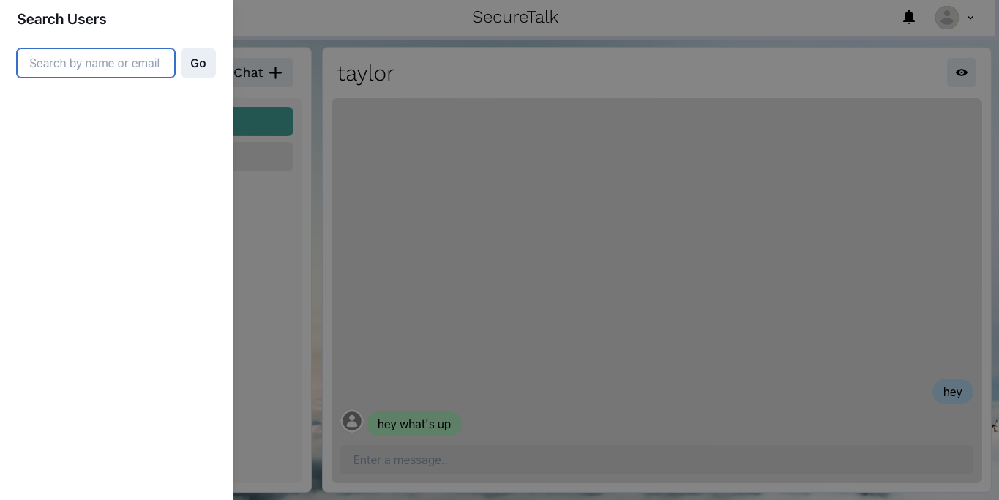
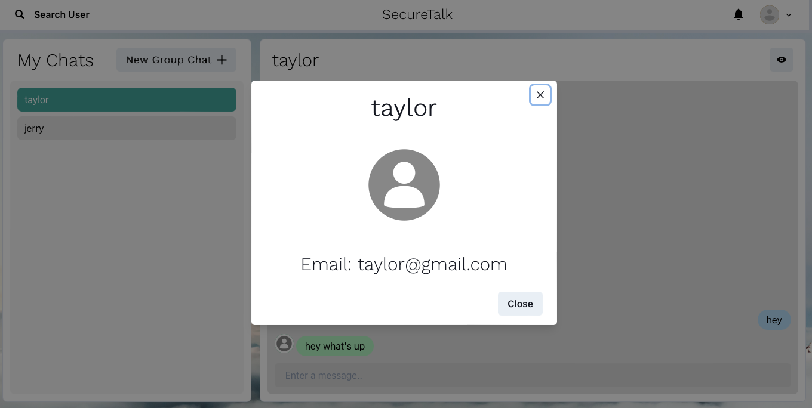
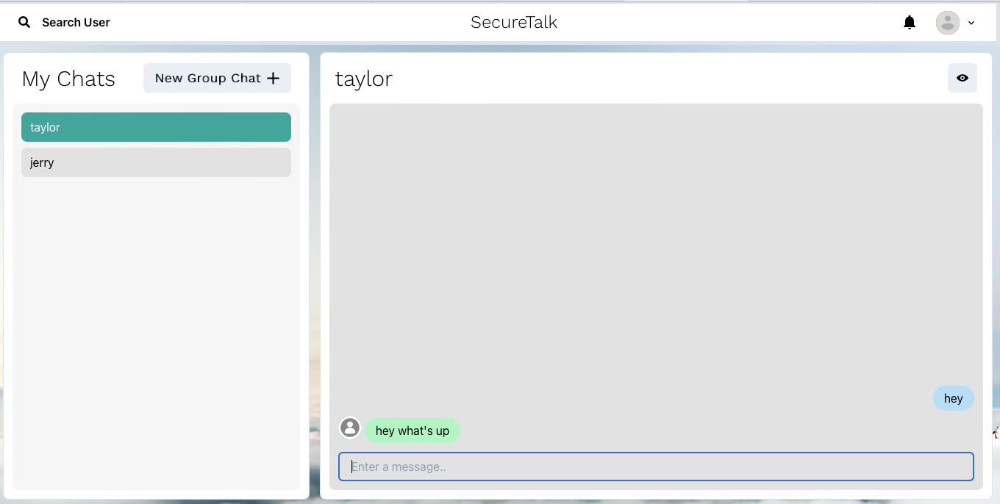

# SecureTalk Application

The application is a secure platform where users can privately chat with other users as well as form group chats with multiple users. This application essentially incorporates features such as live-time messaging, group chat formation, user search, adding users, live-time notifications, and user authentication.

# SCREENSHOT OF THE GAME

# TECHNOLOGIES USED

- MongoDB
- ExpressJS
- Node.js
- CSS
- HTML
- JavaScript
- Socket.io
- ReactJS

# GETTING STARTED

[Click to view the SecureTalk App!](https://securetalk.onrender.com)

# NEXT STEPS

- Image uploading in chats/messages (Sending photos as messages with captions available)
- Video Call
- Voice Call
- Voice Messages
